# ARQSOFT_1240466_1240464

This README has all the documentation for the P2 of ARQSOFT project.

**Group**:
- Ivo Moutinho : 1240464
- João Cordeiro : 1240466

## Index

- [UML Diagrams](#uml-diagrams)
  - [System-to-be](#system-to-be)
    - [Logical View](#logical-view)
      - [Level 1](#level-1)
      - [Level 2](#level-2)
      - [Level 3](#level-3)
    - [Process View](#process-view)
      - [Level 1](#level-1-1)
      - [Level 2](#level-2-1)
      - [Level 3](#level-3-1)
    - [Development View](#development-view)
      - [Level 1](#level-1-2)
      - [Level 2](#level-2-2)
    - [Physical View](#physical-view)
      - [Level 1](#level-1-3)
      - [Level 2](#level-2-3)
- [Alignment with business requirements](#alignment-with-business-requirements)
  - [Functionality 1: As a librarian, I want to create a Book, Author and Genre in the same process.](#functionality-1-as-a-librarian-i-want-to-create-a-book-author-and-genre-in-the-same-process)
  - [Functionality 2: As a librarian, I want to create a Reader and the respective User in the same request.](#functionality-2-as-a-librarian-i-want-to-create-a-reader-and-the-respective-user-in-the-same-request)
  - [Functionality 3: As a reader, upon returning a Book, I want to leave a text comment about the Book and grading it (0-10).](#functionality-3-as-a-reader-upon-returning-a-book-i-want-to-leave-a-text-comment-about-the-book-and-grading-it-0-10)
- [Adoption of microservices patterns](#adoption-of-microservices-patterns)

## UML Diagrams

### System-to-be

The **System-to-be** is the term used to describe the vision and design of a new system. It outlines the requirements, functionalities, and improvements that a future system will have, with the goal of replacing or enhancing the current one. Essentially, it's the plan for how things should be in the future, addressing the limitations of the present.

#### Logical View

##### Level 1

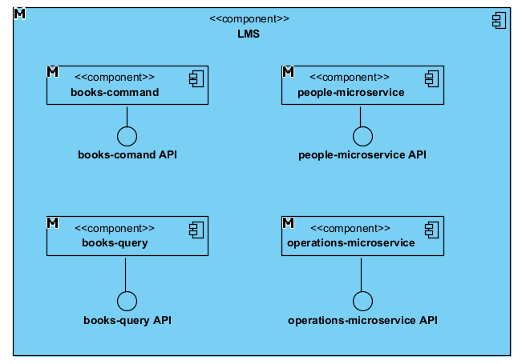

##### Level 2

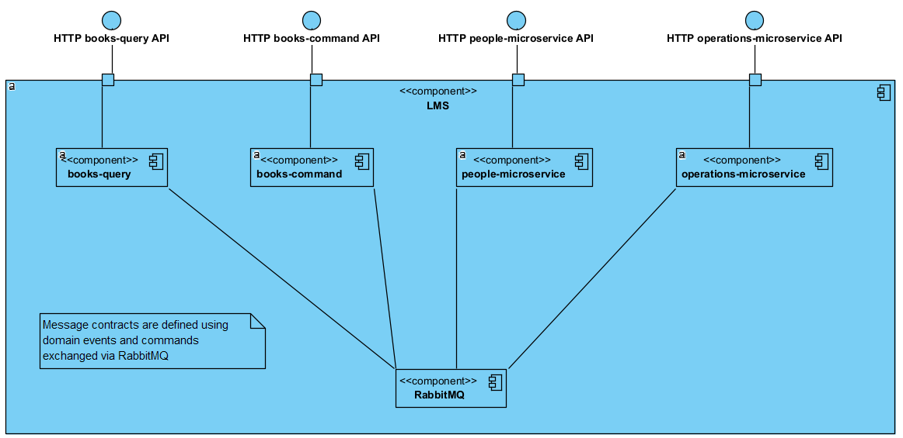

##### Level 3

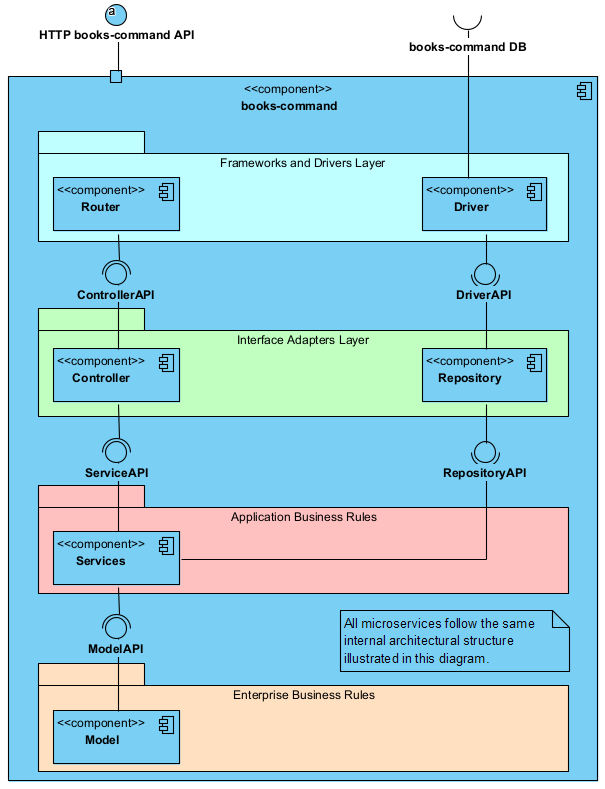

#### Process View

##### Functionality 1: As a librarian, I want to create a Book, Author and Genre in the same process.

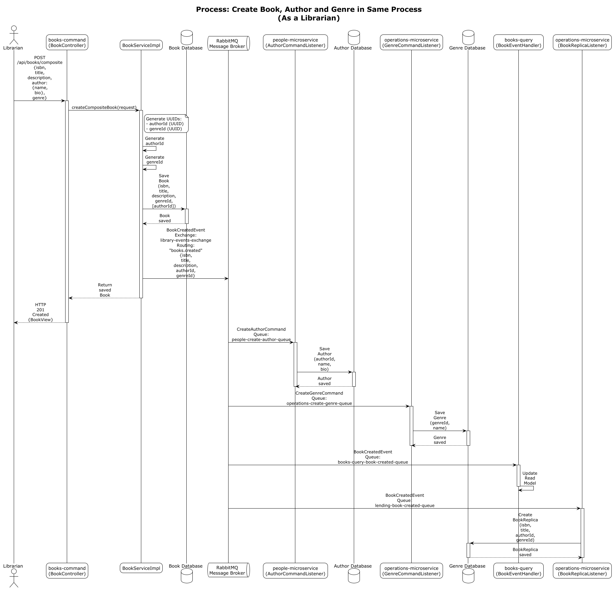

##### Functionality 2: As a librarian, I want to create a Reader and the respective User in the same request.

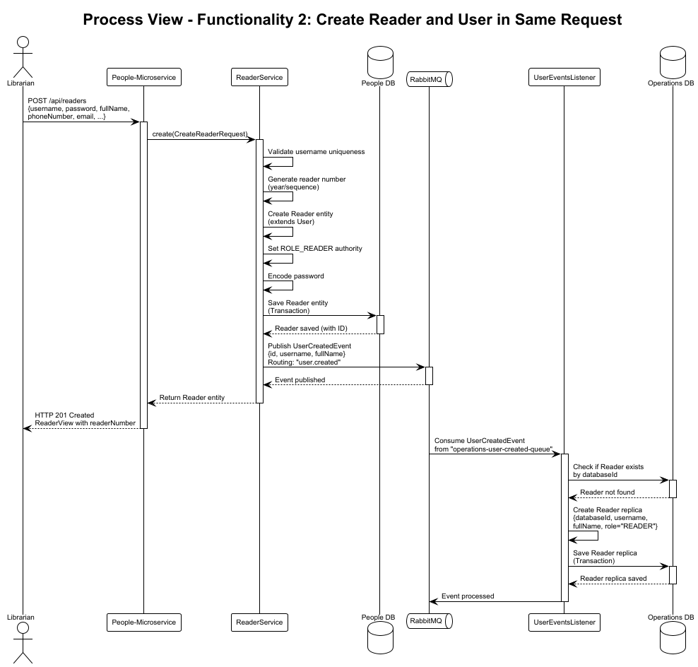

##### Functionality 3: As a reader, upon returning a Book, I want to leave a text comment about the Book and grading it (0-10).

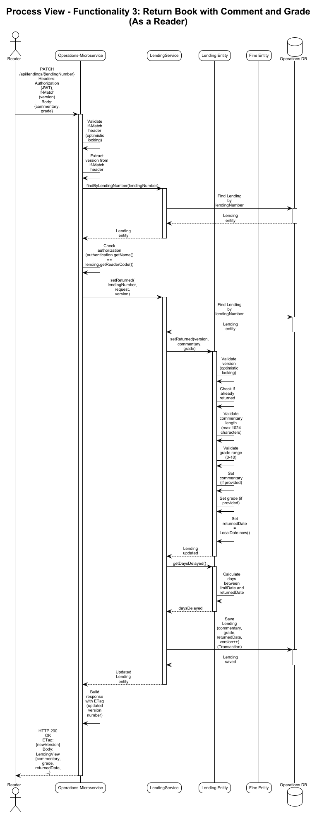

#### Development View

##### Level 1

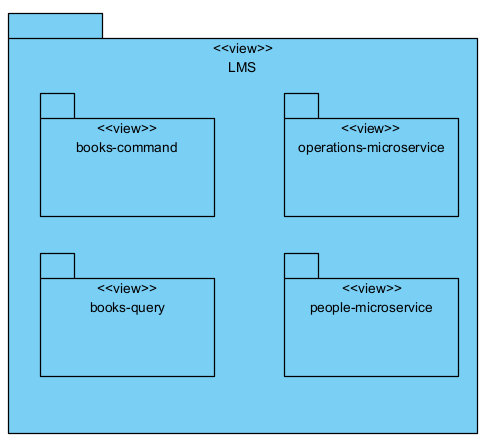

##### Level 2

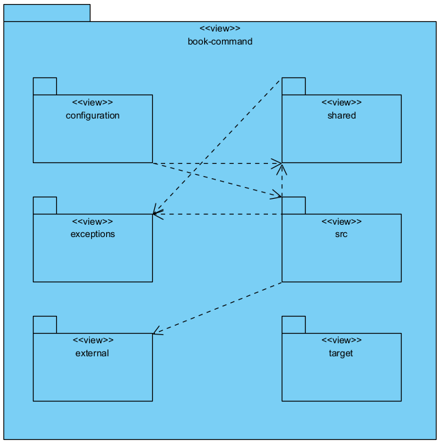

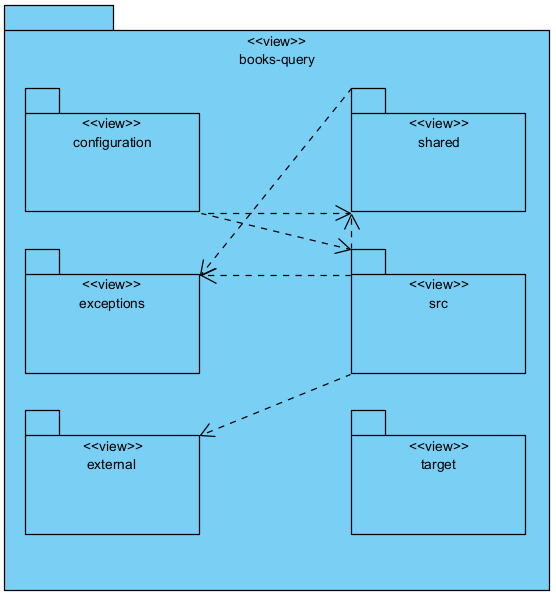

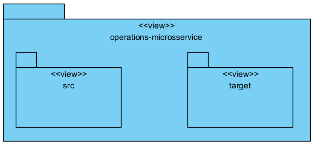

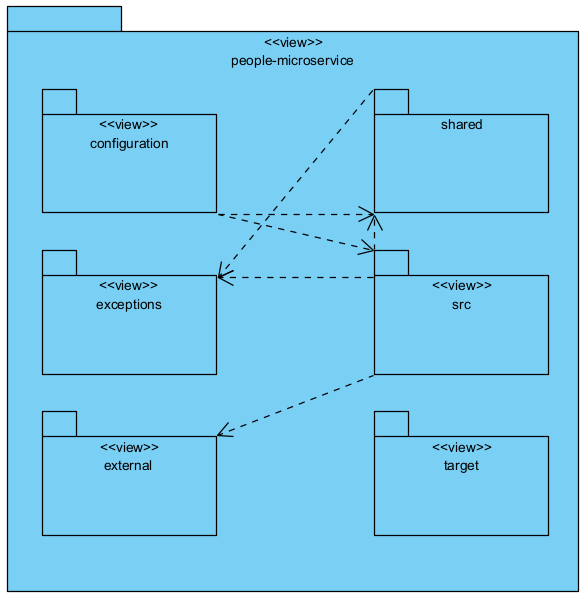

#### Physical View

##### Level 1

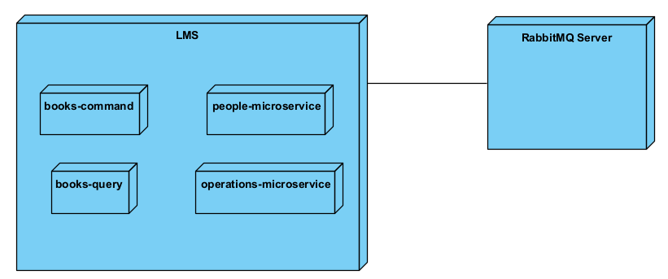

##### Level 2

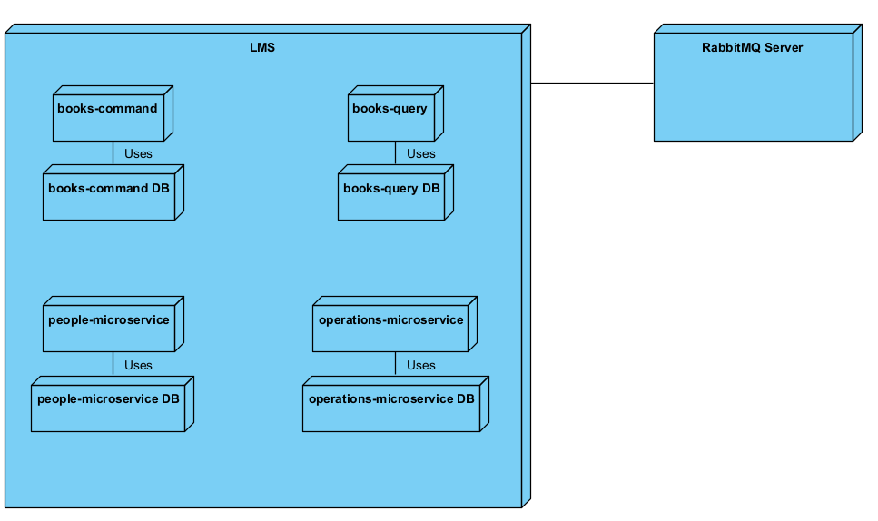


## Alignment with business requirements

This microservices architecture represents a progressive migration from the original monolithic system (P1), where capabilities were incrementally extracted based on business criticality, traffic patterns, and technical risk. Rather than a full system rewrite, services were decomposed selectively to deliver early business value while preserving system stability.
The proposed architecture adopts a Microservices approach driven by Domain-Driven Design (DDD) principles. The system is decomposed into Bounded Contexts, each aligned with a distinct business capability. This ensures high cohesion within services and loose coupling between them, enabling independent evolution and scalability.
The mapping between business requirements and the implemented microservices is defined as follows:

### 1. Book Inventory Management (books-command / books-query)
The core capability of the Library Management System (LMS) — managing the book inventory — has been identified as a high-traffic domain with asymmetric workloads (the frequency of viewing books is significantly higher than adding new ones). To support this, the Command Query Responsibility Segregation (CQRS) pattern was applied:
- Write Capability (books-command): Responsible for the consistency and validation of data during creation or modification. It ensures business rules are enforced (e.g., ISBN validation with check digit verification for both ISBN-10 and ISBN-13 formats, duplicate ISBN detection, and optimistic locking for concurrent updates) without the burden of optimizing for search.
- Read Capability (books-query): Optimized specifically for data retrieval and user queries. By isolating this capability, the system can offer efficient read operations (including filtering by genre and author, and retrieval by ISBN) to users without impacting the transactional integrity of the write side. The read model is kept synchronized with the write model through event-driven messaging, where books-command publishes domain events (e.g., BookCreatedEvent, BookDeletedEvent) via RabbitMQ, which are consumed by books-query to update its read-optimized database.

Synchronization between the write and read models is achieved through event-driven communication. The books-command service publishes domain events (e.g., BookCreatedEvent, BookDeletedEvent) via RabbitMQ, which are consumed by books-query to update its read-optimized data store. This design supports scalability while maintaining eventual consistency, aligning with real-world library usage patterns.

### 2. People Management (people-microservice)
People management represents a business capability with distinct security and isolation requirements, as it handles sensitive personal data such as usernames, email addresses, phone numbers, and full names. Extracting this capability into its own microservice reduces risk and supports regulatory and authentication-related concerns.

The people-microservice uses OAuth2/JWT-based authentication, enabling secure access control and providing a foundation for future Single Sign-On (SSO) or identity provider integrations. Isolating authentication and user identity concerns ensures that changes to security mechanisms do not impact inventory or lending services.

While GDPR-related considerations are reflected in the design (e.g., inclusion of a GDPR consent field during reader creation), full compliance mechanisms would be required in a production environment. Nonetheless, this service demonstrates clear alignment between business requirements for user data protection and the chosen architectural boundaries.

### 3. Operations and Lending Management (operations-microservice)
The operations-microservice encapsulates the core transactional domain of the LMS: lending and returning books. This capability directly supports the primary business process of the library and was therefore extracted with careful attention to consistency and independence.

The service manages lending relationships between People and Books, maintaining its own transactional state. To avoid tight coupling with other services, it subscribes to domain events published by the books and people microservices, allowing it to maintain local replicas of required reference data.

This event-driven approach enables the operations service to function autonomously while remaining synchronized with upstream changes. By isolating lending logic, the architecture segregates transactional complexity from catalog management and user identity concerns, improving maintainability and supporting future extensions (e.g., reservations, fines, or notifications).

## Functionality 1: As a librarian, I want to create a Book, Author and Genre in the same process.

### Quality Attribute Scenario: Create Book, Author, and Genre in a Single Process

| Quality Attribute Element | Description |
|--------------------------|-------------|
| **Stimulus** | A composite HTTP POST request is sent to the `/api/books/composite` endpoint containing Book data, Author data (name, bio), and Genre data (name). |
| **Stimulus Source** | An authenticated librarian using an external REST API client such as a web application, mobile application, or API testing tool. |
| **Environment** | The system is operating under normal load conditions with all microservices available, RabbitMQ operational, databases accessible, and no concurrent requests using the same ISBN. |
| **Artifact** | Books-command microservice, People microservice, Operations microservice, RabbitMQ message broker, and their associated persistence layers. |
| **Response** | The system validates input and permissions, generates identifiers for Author and Genre, publishes creation commands asynchronously, persists the Book entity, emits a BookCreated event, and returns an HTTP 201 Created response with the created Book representation. |
| **Response Measure** | The HTTP response is returned within 500 ms; the Book is immediately persisted; Author and Genre entities are created asynchronously within 5 seconds; duplicate ISBN requests are rejected; eventual consistency is achieved across services. |

### Technical Memo: Create Book, Author, and Genre in a Single Process

#### Problem

The system must support the creation of a Book together with a new Author and a new Genre in a single user operation.  
The system is composed of multiple microservices, where Books, Authors, and Genres are managed independently and persist data in separate databases.  
A single atomic transaction across these services is not available.  
The solution must allow a single request while preserving service autonomy, system availability, and acceptable performance.

---

#### Summary of Solution

A composite creation mechanism was implemented in the books-command service.  
The service processes a single request, generates identifiers for related entities, persists the Book entity locally, and publishes asynchronous commands for Author and Genre creation.  
The approach relies on asynchronous messaging and eventual consistency across services.

---

#### Factors

##### Business Factors
- Reduction of manual steps required to create related entities
- Support for a single user-facing operation
- Continuous system availability during partial service failures

##### Technical Factors
- Independent microservices with separate data ownership
- No distributed transactions
- Use of asynchronous communication
- Acceptable eventual consistency model
- Performance requirement for fast HTTP response

##### Architectural Factors
- Clear service boundaries
- Loose coupling between services
- Failure isolation between components
- Message-based communication

---

#### Solution

The books-command service exposes a composite API endpoint that accepts Book, Author, and Genre data.  
The service validates the request, generates identifiers for Author and Genre, persists the Book entity, and publishes creation commands via a message broker.  
Author and Genre services process their respective commands asynchronously and persist their entities independently.  
A domain event is published after Book creation.

---

#### Motivation

The selected approach enables a single-request workflow while preserving microservice independence.  
Asynchronous processing improves availability and responsiveness by avoiding synchronous dependencies between services.  
The solution aligns with microservice architectural principles and supports scalability under concurrent load.

---

#### Alternatives Considered

- Synchronous Service Calls:Rejected due to tight coupling, increased latency, and risk of cascading failures.

- Distributed Transactions: Rejected due to performance overhead, reduced availability, and increased complexity.

---

#### Pending Issues

- Lack of retry and compensation mechanisms for failed command processing
- Missing idempotency handling for repeated requests
- Limited observability for asynchronous operations
- Incomplete implementation of Genre command handling

---

## ADD-driven design, visual models & alternatives


### Functionality 2: As a librarian, I want to create a Reader and the respective User in the same request.

#### Quality Attribute Scenario: Create Reader and User in a Single Request

| Quality Attribute Element | Description |
|--------------------------|-------------|
| **Stimulus** | A composite HTTP POST request is sent to the `/api/readers/composite` endpoint containing Reader data and User data . |
| **Stimulus Source** | An authenticated librarian using an external REST API client such as a web application, mobile application, or API testing tool. |
| **Environment** | The system is operating under normal load conditions with all microservices available, RabbitMQ operational, databases accessible, and no concurrent requests using the same username. |
| **Artifact** | People-microservice, Operations-microservice, RabbitMQ message broker, and their associated persistence layers. |
| **Response** | The system validates input and permissions, creates the Reader entity (which extends User) in people-microservice, generates a reader number, publishes a UserCreatedEvent asynchronously, persists the Reader entity, and returns an HTTP 201 Created response with the created Reader representation. The operations-microservice receives the event and creates its own Reader representation. |
| **Response Measure** | The HTTP response is returned within 500 ms; the Reader is immediately persisted in people-microservice; the UserCreatedEvent is published within 100 ms; the Reader representation in operations-microservice is created asynchronously within 5 seconds; duplicate username requests are rejected; eventual consistency is achieved across services. |

#### Technical Memo: Create Reader and User in a Single Request

##### Problem

The system must support the creation of a Reader and its corresponding User representation in a single user operation.  
Reader data is managed across two microservices: the people-microservice, which handles users and authentication, and the operations-microservice, which manages reader-related operational data.  
Each microservice maintains its own database and transaction boundaries.  
The solution must allow a single request from the user perspective while avoiding distributed transactions and preserving service autonomy.

---

##### Summary of Solution

A composite creation mechanism was implemented in the people-microservice.  
The service creates the Reader entity (which extends User) in a single local transaction and publishes a user creation event.  
The operations-microservice listens to this event and creates or updates its own Reader representation asynchronously.  
The solution relies on asynchronous event-driven communication and eventual consistency.

---

##### Factors

###### Business Factors
- Support for a single-step reader registration process
- Consistent reader representation across services
- Continued system availability during partial failures

###### Technical Factors
- Independent microservices with separate databases
- No use of distributed transactions
- Asynchronous communication via RabbitMQ
- Eventual consistency is acceptable
- Reader extends User using single-table inheritance in people-microservice
- Separate Reader model required in operations-microservice

###### Architectural Factors
- Clear separation of bounded contexts
- Loose coupling between services
- Failure isolation
- Event-driven synchronization between services

---

##### Solution

The people-microservice exposes a composite API endpoint for reader creation.  
The service validates input, generates a reader number, creates and persists the Reader entity (as a User subtype), and publishes a `UserCreatedEvent`.  
The operations-microservice consumes the event and creates or updates its Reader representation independently.  
Each service executes its own transaction without cross-service coordination.

---

##### Motivation

The selected approach supports a single user-facing operation while maintaining microservice independence.  
Asynchronous event propagation avoids synchronous dependencies and improves availability and performance.  
The solution aligns with event-driven microservice architecture principles and supports scalability under concurrent load.

---

##### Alternatives Considered

- Synchronous Service Calls: Rejected due to tight coupling, increased latency, and risk of cascading failures.

- Distributed Transactions: Rejected due to performance overhead, reduced availability, and architectural complexity.

---

##### Pending Issues

- No retry mechanism for failed event processing in operations-microservice
- Missing idempotency handling for repeated user creation events
- Limited observability of asynchronous event processing
- No compensation mechanism if reader creation fails in operations-microservice
- Insufficient monitoring and alerting for event delays

---

### Functionality 3: As a reader, upon returning a Book, I want to leave a text comment about the Book and grading it (0-10).

| Quality Attribute Element | Description |
|--------------------------|-------------|
| **Stimulus** | A conditional HTTP PATCH request is sent to the `/api/lendings/{lendingNumber}` endpoint containing commentary and grade (integer between 0-10) data. |
| **Stimulus Source** | An authenticated reader using an external REST API client such as a web application, mobile application, or API testing tool. |
| **Environment** | The system is operating under normal load conditions with the operations-microservice available, database accessible, and no concurrent modification attempts on the same lending. |
| **Artifact** | Operations-microservice, its associated persistence layer (Lending entity and repository), and authentication/authorization mechanisms. |
| **Response** | The system validates authentication and authorization (ensuring the requesting reader owns the lending), validates input constraints (commentary length, grade range), applies optimistic locking checks, updates the Lending entity with commentary and grade, sets the returnedDate, creates a Fine entity if the return is overdue, persists the changes in a single transaction, and returns an HTTP 200 OK response with the updated Lending representation including the new commentary and grade. |
| **Response Measure** | The HTTP response is returned within 500 ms; the Lending is immediately persisted with commentary and grade; concurrent modification attempts are rejected via optimistic locking; duplicate return attempts are prevented; validation errors for invalid grade ranges or excessive commentary length are returned within 400 ms. |
#### Technical Memo

##### Problem

The system must support the return of a book by a reader with an optional text comment and a numerical grade (0-10) in a single operation.  

Lending data, including return information, is managed within the operations-microservice, which maintains its own database and transaction boundaries.  

The solution must ensure data integrity (preventing duplicate returns, handling concurrent updates), enforce authorization (only the lending owner can return it), and validate input constraints while maintaining service autonomy and performance.

---

##### Summary of Solution

A conditional update mechanism was implemented in the operations-microservice.  

The service processes a PATCH request that includes commentary and grade fields, validates authentication and authorization, enforces optimistic locking using version control, validates input constraints, updates the Lending entity within a single local transaction, and creates a Fine entity if the return is overdue.  

The solution relies on optimistic concurrency control and local transaction management within a single microservice boundary.

---

##### Factors

###### Business Factors

- Support for reader feedback on returned books through comments and ratings

- Prevention of duplicate or unauthorized return operations

- Automatic fine calculation for overdue returns

- Data integrity and consistency of lending records

###### Technical Factors

- Single microservice transaction scope (no cross-service coordination required)

- Optimistic locking using entity version control (via If-Match header)

- Input validation for commentary length (max 1024 characters) and grade range (0-10)

- Authorization enforcement (reader must own the lending)

- Fine calculation based on days delayed when return date exceeds limit date

###### Architectural Factors

- Service autonomy and independence

- Local transaction management

- RESTful API design with conditional updates

- Security through authentication and authorization

---

##### Solution

The operations-microservice exposes a PATCH endpoint that accepts a SetLendingReturnedRequest containing optional commentary and grade fields.  

The service validates authentication, checks authorization (ensuring the authenticated reader matches the lending's readerId), validates the If-Match header for optimistic locking, validates input constraints (commentary length and grade range), updates the Lending entity's commentary and grade fields, sets the returnedDate, calculates and creates a Fine entity if overdue, and persists all changes in a single database transaction.  

The updated Lending representation is returned to the client with the new commentary and grade included.

---

##### Motivation

The selected approach maintains data integrity within a single service boundary, avoiding distributed transaction complexity.  

Optimistic locking prevents concurrent modification conflicts while maintaining good performance characteristics.  

Local transaction management ensures atomicity of the return operation, fine creation, and commentary/grade persistence.  

The solution aligns with RESTful principles and supports scalability by keeping the operation scoped to a single microservice.

---

##### Alternatives Considered

- Event-Driven Comment/Rating Aggregation: Rejected as comments and ratings are lending-specific rather than book-level aggregations, and the current scope does not require cross-service synchronization.

- Pessimistic Locking: Rejected due to potential performance impact and reduced concurrency compared to optimistic locking for read-heavy workloads.

- Separate Endpoints for Comment and Grade: Rejected due to increased API complexity and the need for multiple requests to complete a single logical operation.

---

##### Pending Issues

- No aggregation mechanism for book-level rating averages across multiple lendings

- Missing event publication to synchronize comment/rating data to books-query service for analytics or display purposes

- Limited validation for commentary content (e.g., profanity filtering, spam detection)

- No support for editing or deleting comments/ratings after submission

- Insufficient monitoring and alerting for failed return operations or validation errors

---

## Adoption of microservices patterns

This section documents the explicit adoption and justification of key microservices patterns implemented in the Library Management System (LMS) architecture. Each pattern addresses specific architectural concerns and enables the system to achieve scalability, maintainability, and operational independence.

### 1. Command Query Responsibility Segregation (CQRS)

**Pattern Adoption**: The CQRS pattern is explicitly implemented through the separation of `books-command` and `books-query` microservices.

**Justification**: 
The book inventory domain exhibits asymmetric read/write workloads, where read operations (searching, browsing, filtering) significantly outnumber write operations (creating, updating, deleting books). By separating command and query responsibilities, the system achieves:

- **Performance Optimization**: The query service can be optimized independently for read-heavy workloads without impacting write-side transactional integrity
- **Scalability**: Read and write services can scale independently based on their respective traffic patterns
- **Simplified Models**: The command side focuses on business rules and validation, while the query side optimizes for search and retrieval patterns

**Implementation Details**:
- **books-command** (Port 8081): Handles all write operations (create, update, delete) with strict validation, optimistic locking, and business rule enforcement
- **books-query** (Port 8082): Optimized read-only service providing search, filtering, and retrieval capabilities
- **Synchronization**: Event-driven synchronization via RabbitMQ ensures eventual consistency between command and query models

**Code Evidence**:
- `books-command/src/main/java/pt/psoft/g1/psoftg1/services/BookServiceImpl.java`: Contains write operations with transaction management
- `books-query/src/main/java/pt/psoft/g1/psoftg1/infrastructure/messaging/BookEventHandler.java`: Consumes `BookCreatedEvent` and `BookDeletedEvent` to maintain read model

---

### 2. Database-per-Service

**Pattern Adoption**: Each microservice maintains its own independent database, ensuring complete data ownership and autonomy.

**Justification**:
Database-per-Service is fundamental to microservices architecture, providing:

- **Service Autonomy**: Each service can evolve its data model independently without affecting other services
- **Technology Flexibility**: Services can choose database technologies that best fit their use cases (though currently all use H2 for development)
- **Failure Isolation**: Database failures in one service do not cascade to others
- **Deployment Independence**: Services can be deployed and scaled independently

**Implementation Details**:
- **books-command**: `jdbc:h2:mem:books_cmd_db` - Stores authoritative book data for write operations
- **books-query**: `jdbc:h2:mem:books_qry_db` - Read-optimized replica for query operations
- **operations-microservice**: `jdbc:h2:mem:operationsdb` - Manages lending, fines, and operational data
- **people-microservice**: `jdbc:h2:mem:people_db` - Handles users, authors, and authentication data

**Code Evidence**:
- Each service's `application.properties` file defines its own database connection string
- No shared database schemas or cross-service database access

---

### 3. Polyglot Persistence

**Pattern Adoption**: While currently all services use H2 for development, the architecture supports polyglot persistence by maintaining separate databases per service.

**Justification**:
The architecture is designed to support different database technologies per service based on their specific requirements:

- **books-query**: Could benefit from document databases (MongoDB) or search engines (Elasticsearch) for complex search queries
- **operations-microservice**: Relational database (PostgreSQL) is appropriate for transactional lending operations
- **people-microservice**: Could use a graph database for relationship queries or a relational database for structured user data
- **books-command**: Relational database ensures ACID properties for write operations

**Current State**:
All services use H2 in-memory databases for development and testing. In production, each service can be migrated to its optimal database technology without affecting other services.

**Architectural Support**:
- Service boundaries are clearly defined, enabling independent database technology selection
- Event-driven communication ensures services remain decoupled regardless of underlying persistence technology

---

### 4. Events

**Pattern Adoption**: Domain events are extensively used for inter-service communication and state synchronization.

**Justification**:
Event-driven architecture provides:

- **Loose Coupling**: Services communicate through events without direct dependencies
- **Asynchronous Processing**: Non-blocking operations improve system responsiveness
- **Eventual Consistency**: Services can maintain local replicas and synchronize asynchronously
- **Extensibility**: New services can subscribe to events without modifying existing publishers

**Event Types Implemented**:
- **BookCreatedEvent**: Published when a book is created in books-command, consumed by books-query and operations-microservice
- **BookDeletedEvent**: Published when a book is deleted, consumed by query and operations services
- **UserCreatedEvent**: Published by people-microservice when a user/reader is created, consumed by operations-microservice
- **AuthorValidatedEvent**: Published during the author validation saga process

**Code Evidence**:
- `books-command/src/main/java/pt/psoft/g1/psoftg1/shared/events/BookCreatedEvent.java`
- `books-query/src/main/java/pt/psoft/g1/psoftg1/infrastructure/messaging/BookEventHandler.java`
- `operations-microservice/src/main/java/pt/psoft/g1/psoftg1/lendingmanagement/infrastructure/messaging/BookReplicaListener.java`

---

### 5. Messaging (via Message Broker)

**Pattern Adoption**: RabbitMQ is used as the message broker for all asynchronous inter-service communication.

**Justification**:
A message broker provides:

- **Reliability**: Messages are persisted and guaranteed delivery even if consumers are temporarily unavailable
- **Decoupling**: Services communicate through exchanges and queues without knowing each other's locations
- **Scalability**: Multiple consumers can process messages from the same queue
- **Routing Flexibility**: Topic exchanges enable sophisticated routing patterns based on routing keys

**Implementation Details**:
- **Exchange Types**: Topic exchanges are used for flexible routing (`library-events-exchange`, `people-exchange`, `operations-exchange`)
- **Message Format**: JSON serialization using `Jackson2JsonMessageConverter`
- **Queue Durability**: Queues are configured as durable to survive broker restarts
- **Routing Keys**: Pattern-based routing (e.g., `books.created`, `books.deleted`, `authors.validated`)

**Code Evidence**:
- `books-command/src/main/java/pt/psoft/g1/psoftg1/infrastructure/messaging/RabbitMQConfig.java`: Defines exchanges, queues, and bindings
- `books-command/src/main/java/pt/psoft/g1/psoftg1/services/BookServiceImpl.java`: Publishes events using `RabbitTemplate.convertAndSend()`
- All services include RabbitMQ configuration classes defining their respective messaging infrastructure

---

### 6. Saga Pattern

**Pattern Adoption**: The Saga pattern is implemented for the book creation with author validation workflow, ensuring distributed transaction consistency through compensating actions.

**Justification**:
The Saga pattern is essential when business operations span multiple services and require eventual consistency:

- **Distributed Transactions**: No two-phase commit is available across microservices
- **Compensation Logic**: Failed operations can be rolled back through compensating actions
- **Eventual Consistency**: The system achieves consistency through a sequence of local transactions

**Saga Implementation - Author Validation**:
The book creation saga follows this flow:

1. **Step 1**: `books-command` creates a book and publishes `BookCreatedEvent`
2. **Step 2**: `people-microservice` receives the event and validates the author exists
3. **Step 3a (Success)**: If author exists, `people-microservice` publishes `AuthorValidatedEvent` with `isValid=true`
3. **Step 3b (Failure)**: If author doesn't exist, `people-microservice` publishes `AuthorValidatedEvent` with `isValid=false`
4. **Step 4**: `books-command` receives validation result
5. **Step 5a (Compensation)**: If validation failed, `books-command` deletes the book and publishes `BookDeletedEvent` to synchronize other services

**Code Evidence**:
- `people-microservice/src/main/java/pt/psoft/g1/psoftg1/infrastructure/messaging/BookEventsListener.java`: Validates author and publishes validation result
- `books-command/src/main/java/pt/psoft/g1/psoftg1/infrastructure/messaging/AuthorValidationListener.java`: Handles validation result and performs compensation (book deletion) if validation fails

**Saga Characteristics**:
- **Choreography-based**: Services coordinate through events without a central orchestrator
- **Compensating Actions**: Book deletion compensates for invalid author creation
- **Eventual Consistency**: All services eventually reach consistent state

---

### 7. Outbox Pattern

**Pattern Adoption**: While not explicitly implemented with a dedicated outbox table, the pattern's principles are applied through transactional event publishing.

**Justification**:
The Outbox pattern ensures reliable event publishing by guaranteeing that events are published only after the local transaction commits, preventing:

- **Lost Events**: Events are not lost if the service crashes before publishing
- **Inconsistent State**: Events are published only after successful database commits
- **Duplicate Events**: Idempotency can be enforced through outbox tracking

**Current Implementation Approach**:
Events are published within the same transaction as the database operation:

```java
@Transactional
public Book create(CreateBookRequest request) {
    Book savedBook = bookRepository.save(newBook);
    // Event published in same transaction
    rabbitTemplate.convertAndSend(libraryEventsExchange, "books.created", event);
    return savedBook;
}
```

**Recommended Enhancement**:
For production systems, a dedicated outbox table should be implemented:
1. Write event to outbox table in the same transaction as business data
2. Background process polls outbox and publishes events
3. Mark events as published after successful delivery
4. Retry failed publications

**Benefits of Full Outbox Implementation**:
- Guaranteed event delivery even if RabbitMQ is temporarily unavailable
- Transactional consistency between business data and events
- Ability to replay events for recovery or new consumer onboarding

---

### 8. Strangler Fig Pattern

**Pattern Adoption**: The architecture represents a progressive migration from a monolithic system (P1) to microservices, following the Strangler Fig pattern.

**Justification**:
The Strangler Fig pattern enables incremental migration without a risky "big bang" rewrite:

- **Risk Mitigation**: Gradual migration reduces risk compared to complete system replacement
- **Business Continuity**: The system remains operational during migration
- **Incremental Value**: Business value is delivered incrementally as services are extracted
- **Learning and Adaptation**: Architecture decisions can be refined based on experience with each extracted service

**Migration Strategy**:
The README documents: *"This microservices architecture represents a progressive migration from the original monolithic system (P1), where capabilities were incrementally extracted based on business criticality, traffic patterns, and technical risk."*

**Service Extraction Order**:
1. **Book Inventory** (books-command/books-query): High-traffic domain with clear read/write separation
2. **People Management** (people-microservice): Security and isolation requirements
3. **Operations** (operations-microservice): Core transactional domain

**Strangler Fig Characteristics**:
- **Incremental Extraction**: Services extracted one at a time based on priority
- **Coexistence**: Old monolithic components and new microservices coexist during migration
- **Traffic Routing**: New services handle new functionality while legacy system continues operating
- **Gradual Replacement**: Legacy components are replaced as new services prove stable

**Benefits Realized**:
- Independent deployment and scaling of extracted services
- Technology modernization without disrupting existing operations
- Ability to pause or adjust migration strategy based on business needs
- Reduced risk compared to complete system rewrite

---

## Pattern Interdependencies

The patterns work together to create a cohesive microservices architecture:

- **CQRS + Events + Messaging**: CQRS separation is maintained through event-driven synchronization via message broker
- **Database-per-Service + Polyglot Persistence**: Service autonomy enables independent database technology selection
- **Saga + Events + Messaging**: Distributed transactions are coordinated through event-driven saga orchestration
- **Outbox + Events**: Ensures reliable event delivery in distributed systems
- **Strangler Fig + All Patterns**: Enables incremental adoption of all patterns during migration

This pattern combination ensures the system achieves scalability, maintainability, reliability, and operational independence while supporting incremental migration from legacy systems.

